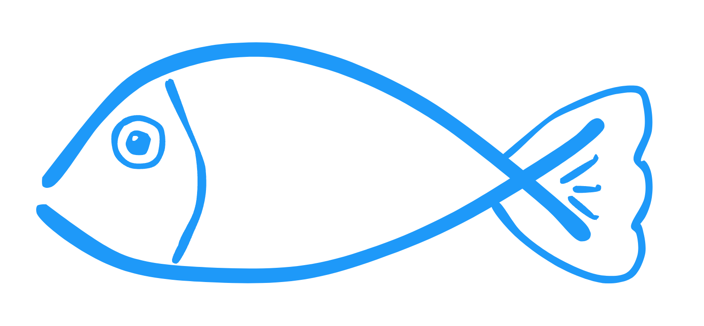

# 
 ConnectFish 

ConnectFish is a work-in-progress Connect 4 engine written in Python. It was created by [@Gapsou](https://github.com/Gapsou) and [@kelseyde](https://github.com/kelseyde).

The goal of the project (aside from just having some fun with pair programming) is to implement a neural-network based evaluation function.

